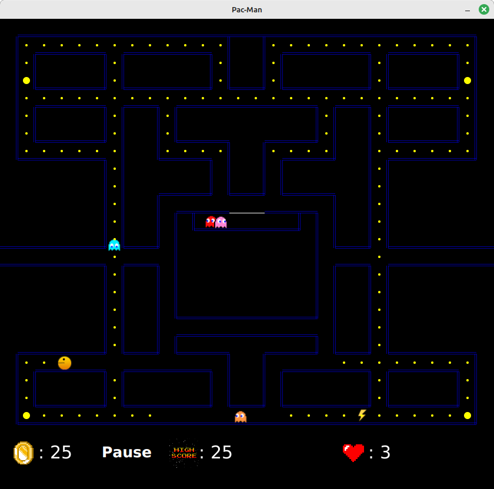

# Jeu de Pacman

## Présentation

Ce Pacman est un jeu d'arcade programmé en Java 17 avec JavaFX. Le projet est configuré avec Gradle utilisant le plugin JavaFX. Ce jeu est largement inspiré du jeu [Pacman](https://fr.wikipedia.org/wiki/Pac-Man), un grand classique de 1980.

Le principe est archi-connu et plutôt simple (se référer à la page Wikipédia).
 
Pour l'instant, seules quelques fonctionnalités basiques sont implémentées... et encore avec des bugs et des tonnes de maladresses. Il est temps de finir ce jeu !

Objectifs de développement :

- déboguer
- rationaliser et documenter le code
- implémenter tout ce qu'on trouve dans tout PacMan de base: le labyrinthe classique, les stratégies des fantômes, les bonus à ramasser, l'effet des super pac-gommes, ...)
- aller plus loin : plusieurs niveaux, 3D, multijoueur, ... (ce ne sont que des suggestions)

## Exécution, compilation

Après avoir téléchargé/cloné les sources, vous pouvez compiler et exécuter le projet à l'aide de gradle.
Le principe c'est que le script `gradlew` dans le répertoire du projet téléchargera puis utilisera la version de gradle qui fonctionne avec le projet.

Pour compiler, il suffit d'exécuter, depuis le répertoire `pacman` :

```bash
`./gradlew build`
```

Pour exécuter, il suffit d'exécuter, depuis le répertoire `pacman` :

```bash
`./gradlew run`
```

Le projet en lui-même a besoin de Java 17 pour être compilé et exécuté.

### Cas particuliers

#### Sur une machine personnelle avec Java 11 à 16

Si vous souhaitez/devez travailler avec une version ancienne de Java, il n'est pas très difficile de modifier la configuration : changez juste les numéros de version dans `build.gradle`.

Ensuite, vous pouvez travailler comme avec Java 17 (le projet devrait pouvoir tourner tel quel).

Important : faites un commit de `build.gradle` et poussez-le sur votre fork pour que toutes votre équipe travaille avec la même version de Java.

#### Sur une machine personnelle avec Java 8 à 10 (DISCLAIMER : compliqué !)

Je n'ai pas testé, mais pacman devrait pouvoir tourner (peut-être avec quelques modifications mineures). Malheureusement, ça peut être un peu compliqué.

Dans les grandes lignes :

- Commencez par désactiver le plugin JavaFX dans gradle (toujours dans `build.gradle`), car celui-ci ne fonctionne qu'à partir de Java 11. 
- Désormais, gradle ne s'occupe plus de télécharger et installer JavaFX. Il faut donc s'assurer de l'avoir installé d'une autre façon. Si vous avez une distribution de Java sans JavaFX (à noter que Oracle Java 8 contient JavaFX), il faut le télécharger et l'installer séparément, en prenant soin de prendre le même numéro de version.
- Si JavaFX a été installé séparément, il faut le faire savoir à gradle pour qu'il ajoute son répertoire au classpath.
- Si vous utilisez Java 9 ou 10, il y a de la configuration de modules JPMS à faire à la main. Je ne vais expliquer, ni ce que c'est, ni en quoi ça consiste ici. Il est possible de trouver de l'aide dans les forums.

Bref, il est grandement conseillé d'utiliser une version plus récente de Java. Néanmoins, si vous n'avez pas le choix et que vous êtes en difficulté, demandez de l'aide à vos enseignants.

Important : là aussi, il faut ensuite que toute votre équipe travaille avec la même version de Java. Faites un commit de `build.gradle` et poussez-le sur votre fork pour que toutes votre équipe travaille avec la même version de Java.

## Jouer

Pacman est contrôlé par les 4 flèches de direction... et c'est tout.
